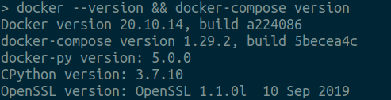
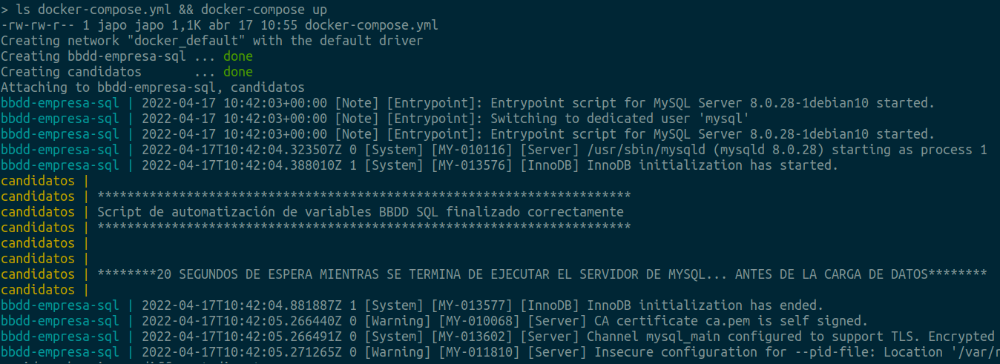
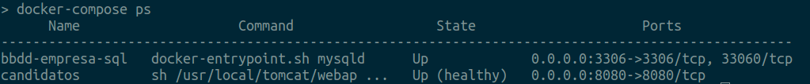
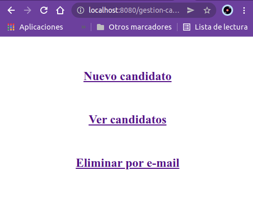
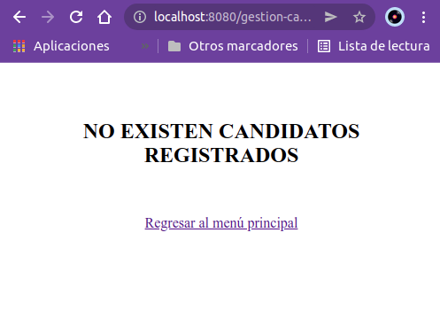
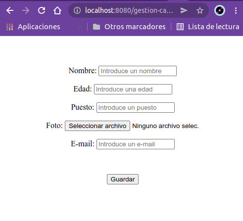
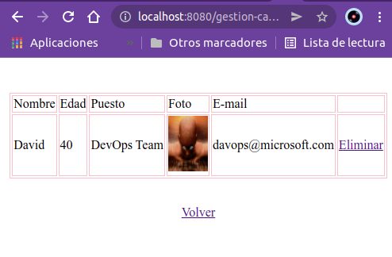
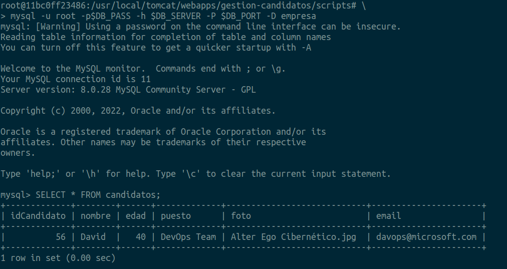
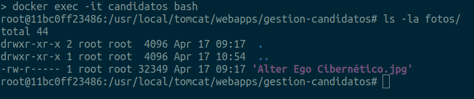
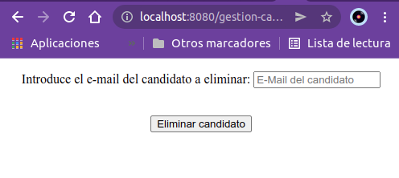

- Instrucciones para ejecutarla en local:

  Para poder ejecutar ésta App en local, será necesario tener instalado Docker, ya que será en entorno dockerizado desde donde se ejecutarán tanto la App como la BBDD SQL:  
  - [Docker Engine](https://www.digitalocean.com/community/tutorials/how-to-install-and-use-docker-on-ubuntu-20-04-es)
  
  - [Docker-Compose](https://docs.docker.com/compose/install/)
  
  Para ello se ha elaborado un fichero **'candidatos.Dockerfile'** que contiene las sentencias correspondientes al cocinado de una imagen Docker en formato **Multi-Stage** y que será cocinada al ejecutar el despliegue de los contenedores mediante docker-compose:
  
  - **Imagen Docker 'compilación'**: Se utiliza una **imagen 'Maven' como base**, que realizará 2 acciones:
  	- Clonará el proyecto con la App Java desde el [repositorio de código GitHub](https://github.com/davidjapo/acme-candidatos)
  	
	- Realizará el build de la App, compilando las clases y empaquetando el proyecto en formato .war listo para ser desplegado en un servidor Tomcat.

  - **Imagen Docker 'app'**: Se utiliza una **imagen 'Tomcat' como base**, que realizará 5 acciones:

    - Copiará el fichero .war empaquetado por Maven en la capa de la imagen anterior y que contiene la aplicación Java lista para ser desplegada.  
    Lo copiará en la carpeta destino del servidor Tomcat desde donde se realizarán los despliegues.
    
    - Instalará paquetería necesaria:
    
        - **Cliente MySQL**: desde donde conectarse para poder enviar el schema de la BBDD al servidor MySQL.
        
        - **GetText** Herramienta para manipular texto.
        
    - Descomprimirá mediante la herramienta Jar de Java, el fichero .war para ayudar en el despliegue de la aplicación.
    
    - A título informativo, se expone el puerto 8080 que será utilizado para la conexión al servidor Tomcat vía HTTP.
    
    - Se define la ejecución de un script bash llamado **'bootstrap.sh'** en la definición del ENTRYPOINT y que será utilizado como punto de entrada en la ejecución de un contenedor de ésta imagen.  
    Este Script ejecutará a su vez otro script bash llamado **'script_variables.sh'** que realiza un cambio de variables en el fichero persistence_temp.xml para dotar de configurabilidad a la App, así como también lanzar el despliegue de la App.

   

**candidatos.Dockerfile**
```dockerfile
FROM maven:3.6.3-jdk-11 AS compilacion
WORKDIR /app-java_temp
RUN git clone https://github.com/davidjapo/acme-candidatos.git .
RUN mvn clean package


FROM tomcat:9.0-jdk11-temurin-focal AS app
WORKDIR /usr/local/tomcat/webapps/gestion-candidatos
COPY --from=compilacion /app-java_temp/target/17_gestion_candidatos_mvc-0.0.1-SNAPSHOT.war ./gestion-candidatos.war
RUN apt update && apt install -y mysql-client gettext && jar -xvf gestion-candidatos.war
EXPOSE 8080
ENTRYPOINT ["sh", "/usr/local/tomcat/webapps/gestion-candidatos/scripts/bootstrap.sh"]
```

<br>

**bootstrap.sh**
```bash
#!/bin/bash

# ESTE SCRIPT SE ENCARGA DE:
#
#  1.- EJECUTAR EL SCRIPT QUE REALIZARÁ EL CAMBIO DE VARIABLES PARA EL FICHERO persistence.xml
#
#  2.- Dormir durante 20 segundos mientras en la primera ejecución del contenedor docker se 
#      configura el servicio de mySQL, ya que al ser la primera vez, quizás no exista el volúmen
#      de datos en docker.
#
#  3.- Una vez finalizado el tiempo de desplegar el servicio mysql, desde el contenedor candidatos
#      se realiza una conexión a la BBDD que está en el contenedor mysql para inyectarle desde fichero
#      la sentencias SQL necesarias para crear el schema junto con la tabla y los atributos correspondientes.
#
#      Los valores de la contraseña de root, el nombre del servidor y el puerto a utilizar, son obtenidos
#      mediante variables de entorno configuradas desde el fichero de variables web.env de docker-compose.
#
#      La conexión al servidor de base de datos desde el contenedor de la aplicación, se puede llevar a cabo
#      gracias a la conexión TCP/IP que existe dentro de la misma red que Docker ha creado al levantar los
#      servicios desde docker-compose, y que permite visibilidad DNS también a nivel de nombre de contenedor,
#      pudiendo así establecer una conexión.
#
#  4.- Terminada de realizar la carga de datos, se ejecuta el script catalina.sh que se encargará de desplegar
#      la App en el servidor de aplicaciones Tomcat.

sh /usr/local/tomcat/webapps/gestion-candidatos/scripts/script_variables.sh

echo ""
echo "********20 SEGUNDOS DE ESPERA MIENTRAS SE TERMINA DE EJECUTAR EL SERVIDOR DE MYSQL... ANTES DE LA CARGA DE DATOS********"
echo ""

sleep 20

echo ""
echo "********R E A L I Z A N D O   C A R G A   D E   D A T O S********"
echo 

mysql -u root -p$DB_PASS -h $DB_SERVER -P $DB_PORT --default-character-set=utf8 -D empresa < /mysql/bbdd_empresa.sql -f

echo ""
echo "**************************************************"
echo "Carga de datos en la BBDD finalizado correctamente"
echo "**************************************************"
echo ""

catalina.sh run

exit 0
```

<br>

**script_variables.sh**
```sh
#!/bin/bash

# ESTE SCRIPT REALIZARÁ UN CAMBIO DE VARIABLES EN LOS FICHEROS DE CONFIGURACIÓN DE LA PERSISTENCIA DE JAVA EE,
# PARA DOTAR DE AUTOMATISMO Y PERSONALIZACIÓN EN CUANTO A LOS VALORES CORRESPONDIENTES A LA BASE DE DATOS:

XML_TMP=./WEB-INF/classes/META-INF/persistence_temp.xml
XML_OUT=./WEB-INF/classes/META-INF/persistence.xml

envsubst "`printf '${%s} ' $(sh -c "env|cut -d'=' -f1")`" < $XML_TMP > $XML_OUT

echo ""
echo "************************************************************************"
echo "Script de automatización de variables BBDD SQL finalizado correctamente"
echo "************************************************************************"
echo ""

exit 0
```

<br>

También se ha elaborado un fichero llamado **'docker-compose.yml'** que contiene las **sentencias en formato YAML** para levantar 2 servicios:

  - Servicio **mysql**:
	  + Se encargará de ejecutar un **contenedor Docker con una imagen de mysql**.  
	  Este contenedor tendrá un **volumen montado para dotar de persistencia a la base de datos** y hará uso del **fichero de variables 'mysql.env'** que contiene los valores de las variables declaradas como **variables de entorno, correspondientes a la conexión con la base de datos**.
  
  - Servicio **web**:
      + Levantará un **contenedor Docker llamado 'app-candidatos:3.0.0' correspondiente al stage 'app' del fichero 'candidatos.Dockerfile'** 


**docker-compose.yml**

```yaml
version: '3'

services:
  mysql:
    container_name: bbdd-empresa-sql
    image: mysql:latest
    ports:
      - "3306:3306"    
    volumes:
      - mysql-data:/var/lib/mysql
    env_file: mysql.env
    restart: unless-stopped
  web:
    container_name: candidatos
    image: app-candidatos:3.0.0
    build:
      context: .
      dockerfile: candidatos.Dockerfile
      target: app
    depends_on:
      - mysql
    ports:
      - "8080:8080"
    volumes:
      - webapp-data:/usr/local/tomcat/webapps/gestion-candidatos/fotos
      - "$PWD/../backup/bbdd_empresa.sql:/mysql/bbdd_empresa.sql:ro"
      - "$PWD/scripts/bootstrap.sh:/usr/local/tomcat/webapps/gestion-candidatos/scripts/bootstrap.sh"
      - "$PWD/scripts/script_variables.sh:/usr/local/tomcat/webapps/gestion-candidatos/scripts/script_variables.sh"
    env_file: web.env
    healthcheck:
      test: ["CMD", "curl", "-f", "http://localhost:8080"]
      interval: 1m30s
      timeout: 10s
      retries: 3
      start_period: 40s
    restart: unless-stopped
    
volumes:
  mysql-data:
  webapp-data:
```

**mysql.env**
```
MYSQL_ROOT_PASSWORD=r00t
MYSQL_DATABASE=empresa
MYSQL_USER=kc-java
MYSQL_PASSWORD=candidatosKC
```

**web.env**
```
DB_SERVER=bbdd-empresa-sql
DB_PORT=3306
BBDD=empresa
DB_TIMEZONE=Europe/Madrid
DB_USER=root
DB_PASS=r00t
DB_DRIVER=com.mysql.cj.jdbc.Driver
DB_URL=jdbc:mysql://bbdd-empresa-sql:3306/empresa?serverTimezone=Europe/Madrid
```

<br>


### A continuación se aportan las capturas de pantalla con los pasos para hacer funcionar la App:

1. Se comprueba que se disponen de los requisitos necesarios para realizar el despliegue en local a través de Docker ejecutando los comandos:  
  **`$ docker --version && docker-compose version`**  


2. Desde el directorio donde se encuentra el fichero docker-compose.yml ejecutar el siguiente comando para desplegar la App:    
  **`$ ls docker-compose.yml && docker-compose up`**



3. Un par de minutos después, se comprueba que el despliegue de los contenedores Docker se ha llevado a cabo y están levantados correctamente y en servicio, ejecutando los comandos:  
  **`$ docker-compose ps && docker ps`**    


4. Para comprobar el funcionamiento de la App, es necesario abrir la siguiente url en un navegador y se visualizará el menú principal de la aplicación:
[**http://localhost:8080/gestion-candidatos**](http://localhost:8080/gestion-candidatos)  


5. Se comprueba que al hacer click en la opción **Ver candidatos**, muestra una página con un mensaje indicando que la base de datos no contiene candidatos registrados:  


6. Al hacer click en la **opción 'Nuevo candidato'**, se muestra la página con un pequeño formulario para cumplimentar los datos del candidato nuevo y al darle al botón Guardar, el servlet FrontController recoge la petición y llama al servlet encargado de darle el alta en la BBDD:  


7. Se comprueba que al hacer click en la opción **Ver candidatos**, se puede visualizar el único candidato registrado hasta el momento, tras darlo de alta en el paso anterior:  


    - Nos conectamos al contenedor de la App para comprobar como la BBDD contiene tuplas, ejecutando los siguientes comandos:  
  **`docker exec -it candidatos bash`**  
  **`mysql -u root -p$DB_PASS -h $DB_SERVER -P $DB_PORT -D empresa`**  
  **`SELECT * FROM candidatos;`**


	- Se comprueba que el fichero de la foto del candidato registrado se encuentra almacenado en el sistema de ficheros del contenedor, ejecutando los siguientes comandos:  
  **`docker exec -it candidatos bash`**  
  **`ls -la fotos/`**  
	

8. Si se hace click en la **opción 'Eliminar por e-mail'**, se puede observar una página con un campo de texto solicitando introducir la dirección de e-mail del candidato a Eliminar.  



<br>
