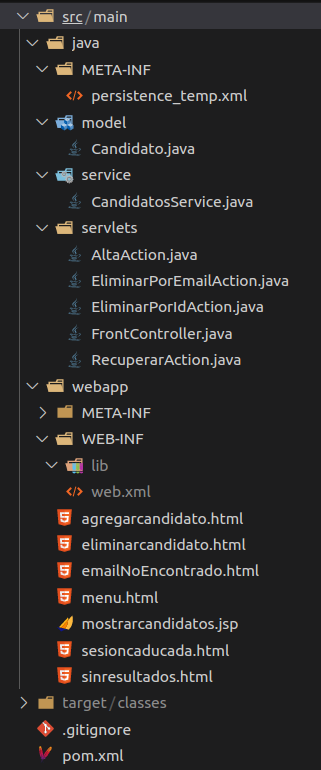
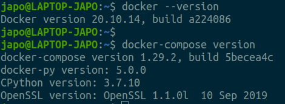
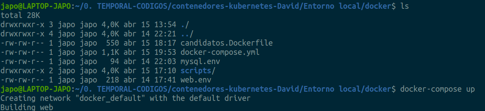
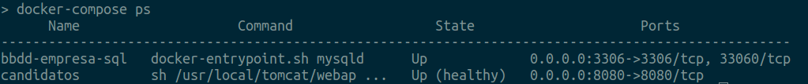
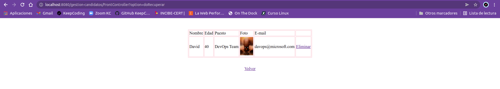

# Práctica Contenedores y Kubernetes - David De la Cruz

<br>

## Contenidos

* [Entorno Local](./Entorno%20local#readme)
* [Entorno K8S](./k8s#readme)
* [Entorno Monitorización](./monitoring#readme)

<br>

### Lectura necesaria para comprender el proyecto y poder ponerlo en funcionamiento:

- Descripción de la aplicación:

	Se trata de una **Aplicación Web desarrollada en JavaSE-11, JavaEE-7,** llamada **'gestion-candidatos'** que **realiza las** siguientes **acciones**:
	
	-  **Alta** de **nuevos candidatos** de la empresa ACME **en un RDBMS SQL (MySQL 8)**, mediante cumplimentación de un breve formulario web.
	-  **Visualizar** los **candidatos registrados en la BBDD** (incluida una foto) en formato tabla.
	-  **Eliminar** un **candidato desde la Vista de candidatos registrados**, haciendo click en la **opción 'Eliminar'** del candidato elegido.
	-  **Eliminar** un **candidato,** cumplimentando su **dirección de e-mail** en un campo de texto de un formulario web.

<br>

- Funcionamiento de la aplicación:  

    **La aplicación** java **se divide en 5 partes**:
	
  **1.- Modelo de datos**
: Queda plasmado en la **clase java 'Candidato.java'** y contiene **6 atributos** que caracterizan a un **objeto Candidato**, como son:
     - id  
     - nombre
     - edad
     - puesto
     - foto
     - e-mail

     Esta clase también contiene los correspondientes **"Setter y Getter"** de los atributos mencionados, así como también un **constructor sobrecargado** que se encargará de crear el objeto Candidato con los valores que se le pasen en sus variables.
   
     También refleja diferentes **anotaciones** correspondientes a la **persistencia JPA**, que a continuación se muestran:  

**candidato.java**

```java
package model;

import java.io.Serializable;
import javax.persistence.*;


/**
 * The persistent class for the candidatos database table.
 * 
 */
@Entity
@Table(name="candidatos")
@NamedQuery(name="Candidato.findAll", query="select c from Candidato c")
@NamedQuery(name="Candidato.findByPuesto", query="select c from Candidato c where c.puesto=?1")
@NamedQuery(name="Candidato.findByEmail", query="select c from Candidato c where c.email=?1")
@NamedQuery(name="Candidato.deleteByEmail", query="delete from Candidato c where c.email=?1")
public class Candidato implements Serializable {
	private static final long serialVersionUID = 1L;

	@Id
	@GeneratedValue(strategy=GenerationType.IDENTITY)
	private int idCandidato;
	
	@Column(name = "edad")
	private int edad;

	private String email;

	private String foto;

	private String nombre;

	private String puesto;

	public Candidato() {
	}
	
	public Candidato(int idCandidato, String nombre, int edad, String puesto, String foto, String email) {
		super();
		this.idCandidato = idCandidato;
		this.nombre = nombre;
		this.edad = edad;
		this.puesto = puesto;
		this.foto = foto;
		this.email = email;
	}

	public int getIdCandidato() {
		return this.idCandidato;
	}

	public void setIdCandidato(int idCandidato) {
		this.idCandidato = idCandidato;
	}

	public int getEdad() {
		return this.edad;
	}

	public void setEdad(int edad) {
		this.edad = edad;
	}

	public String getEmail() {
		return this.email;
	}

	public void setEmail(String email) {
		this.email = email;
	}

	public String getFoto() {
		return this.foto;
	}

	public void setFoto(String foto) {
		this.foto = foto;
	}

	public String getNombre() {
		return this.nombre;
	}

	public void setNombre(String nombre) {
		this.nombre = nombre;
	}

	public String getPuesto() {
		return this.puesto;
	}

	public void setPuesto(String puesto) {
		this.puesto = puesto;
	}

 }
```

<br>

  **2.- Lógica de negocio (capa de servicio)**
: Se encuentra detallada en la clase **CandidatosService.java** y contiene:
    
1. Bloque de código estático con la **definición de la unidad de persistencia** y que será utilizada para almacenar los datos de conexión a la BBDD.
       
2. Se declaran **5 métodos** que corresponderán a las **acciones CRUD**:

    - altaCandidato
    - eliminarCandidato
    - recuperarCandidatos
	- buscarByEmail
    - eliminarCandidatoPorEmail
<br>

**CandidatosService.java**
```java
package service;

import java.util.List;

import javax.persistence.EntityManager;
import javax.persistence.EntityManagerFactory;
import javax.persistence.EntityTransaction;
import javax.persistence.Persistence;
import javax.persistence.Query;
import javax.persistence.TypedQuery;
import javax.persistence.NoResultException;
import javax.persistence.NonUniqueResultException;
import model.Candidato;

//En esta clase se encuentra toda la lógica de negocio correspondiente al acceso a datos:
public class CandidatosService {
	
	private static EntityManager em;
	
	//Se hace uso de la unidad de persistencia para envolver los datos correspondientes a la conexión con la BBDD:
	static {
		EntityManagerFactory factory = Persistence.createEntityManagerFactory("empresaPU");
		em=factory.createEntityManager();
	}
	
	//Método que añade una tupla en la BBDD correspondiente a un candidato en concreto:
	public void altaCandidato(Candidato candidato) {
		EntityTransaction tx=em.getTransaction();
		tx.begin();
			em.persist(candidato);
		tx.commit();
	}
	
	//Método que elimina un candidato correspondiente al id del Candidato:
	public void eliminarCandidato(int idCandidato) {
		Candidato candidato = em.find(Candidato.class, idCandidato);
		EntityTransaction tx=em.getTransaction();
		tx.begin();
			if(candidato!=null) {
				em.remove(candidato);
			}
		tx.commit();
	}
	
	//Metodo que se encarga de obtener los candidatos registrados en format lista de objetos Candidato:
	public List<Candidato> recuperarCandidatos(){
		//Se utiliza el método createNamedQuery del objeto EntityManager para acceder a la consulta nominada:
		TypedQuery<Candidato> query = em.createNamedQuery("Candidato.findAll", Candidato.class);
		return query.getResultList();
	}

	//¡OJO! Se producen excepciones que hay controlar en caso de que no existan resultados para dicha condición,
	//o exista más de un resultado con la misma condición.
	//Se hace uso de try/catch (multicatch) para capturar la excepción:
	//TODAS LAS EXCEPCIONES EN JPA SON RUNTIME, NO OBLIGA A CAPTURARLAS, PERO SE DEBE DE CONTROLAR:
	public Candidato buscarByEmail(String email) {
		TypedQuery<Candidato> query = em.createNamedQuery("Candidato.findByEmail", Candidato.class);
		query.setParameter(1, email);
		Candidato encontrado;
		try {
			encontrado = query.getSingleResult();
		}catch(NoResultException | NonUniqueResultException e) {
			//e.printStackTrace();
			return null;
		}
		return encontrado;
	}
		
	//Otra funcionalidad, utilizando una sentencia JPQL de acción.
	//Este método se encarga de eliminar un candidato mediante el email facilitado:
	public void eliminarCandidatoPorEmail(String email) {
		EntityTransaction tx = em.getTransaction();
		tx.begin(); //Siempre que sea una consulta de acción, hay que iniciar la transacción.
		Query query = em.createNamedQuery("Candidato.deleteByEmail");
		query.setParameter(1, email);
		query.executeUpdate();
		tx.commit();
	}	
}
```

<br>

  **3.- Servlets**
: Se definen **5** clases, que serán las **clases de acción**, que corresponden con los **métodos CRUD anteriores** y que serán **llamados desde la clase FrontController**, que es el orquestador de todas estas acciones:

* **altaAction.java**
: Este servlet se encargará de **dar de alta el candidato.**    

  Contiene **3 métodos**:

    - **service**: Realiza la recuperación de los parámetros obtenidos mediante el formulario web, crea el objeto Candidato y llama al método de la capa de servicio que corresponde con la acción de dar de alta el candidato en la BBDD.
    
    - **obtenerNombreFichero**: Como bien su nombre indica, este método se encarga de obtener el nombre del fichero de la foto.
    
    - **guardarFicheroEnServidor**: Este método se encarga de almacenar el fichero de la foto en el sistema de archivos.


```java
package servlets;

import java.io.IOException;
import java.util.Collection;
import java.util.List;

import javax.servlet.ServletException;
import javax.servlet.annotation.MultipartConfig;
import javax.servlet.annotation.WebServlet;
import javax.servlet.http.HttpServlet;
import javax.servlet.http.HttpServletRequest;
import javax.servlet.http.HttpServletResponse;
import javax.servlet.http.Part;

import model.Candidato;

import java.io.InputStream;
import java.io.FileOutputStream;

import service.CandidatosService;

@MultipartConfig //Permite al servlet procesar objetos binarios (es decir, el contenido de un archivo)
@WebServlet("/AltaAction")
public class AltaAction extends HttpServlet {
	private static final long serialVersionUID = 1L;
	
	protected void service(HttpServletRequest request, HttpServletResponse response) throws ServletException, IOException {
		//Creamos un objeto correspondiente a la clase de la lógica de negocio:
		CandidatosService service = new CandidatosService(); 
		
		//Recuperamos los parámetros desde el cliente HTML:
		String nombre= request.getParameter("nombre");
		int edad= Integer.parseInt(request.getParameter("edad"));
		String puesto= request.getParameter("puesto");
	
		//Recuperamos el parámetro foto como objeto Part:
		Part foto = request.getPart("foto");
		String email = request.getParameter("email");
		
		//Muestra la lista de los encabezados de la petición :
		/*Collection<String> headers = foto.getHeaderNames();
		headers.forEach(h -> System.out.println(h+": "+ foto.getHeader(h)));*/
		
		String nombreFichero=obtenerNombreFichero(foto);
		
		//El constructor requiere que pongamos primero un int correspondiente al idCandidato, pero como es auto-numérico, se coloca un cero.
		Candidato nuevoCandidato= new Candidato(0,nombre,edad,puesto,nombreFichero,email);
		
		//Se llama al método de altaCandidato de la capa de servicio, para añadir el nuevo candidato a la BBDD:
		service.altaCandidato(nuevoCandidato);
		
		//Se llama al método que se encarga de almacenar la foto:
		guardarFicheroEnServidor(request,foto,nombreFichero);
	}
	
	//Método para obtener el nombre del fichero de la foto:
	private String obtenerNombreFichero(Part part) {
		for(String cd:part.getHeader("content-disposition").split(";")) {
			if(cd.trim().startsWith("filename")) {
				String fileName = cd.substring(cd.indexOf('=')+1).trim().replace("\"", "");
				//return fileName.substring(fileName.lastIndexOf('/')+1).substring(fileName.lastIndexOf('\\'+1)); //MSIE fix.
				return fileName;
			}
		}
		return null;
	}
	
	//Este método almacena la foto en la ruta "raíz de la aplicación/foto:
	private void guardarFicheroEnServidor(HttpServletRequest request, Part part, String nombreFichero) {
		String url = request.getServletContext().getRealPath("/");

		try {
			part.write(url+"/fotos/"+nombreFichero);
		} catch (IOException e) {
			// TODO Auto-generated catch block
			e.printStackTrace();
		}
	}
}
```

<br>

* **RecuperarAction.java**
: Este servlet, en su único método service, **llama al método de la capa de servicio que se encarga de obtener la lista con los Candidatos almacenados en la BBDD**, guardarlos temporalmente en memoria Ram **para servirlos a la clase FrontController** que llamará a la Vista correspondiente que se encargará de pintar los datos:

```java
package servlets;

import java.io.IOException;
import javax.servlet.ServletException;
import javax.servlet.annotation.WebServlet;
import javax.servlet.http.HttpServlet;
import javax.servlet.http.HttpServletRequest;
import javax.servlet.http.HttpServletResponse;
import service.CandidatosService;
import model.Candidato;
import java.util.List;

/**
 * Servlet implementation class RecuperarAction
 */
@WebServlet("/RecuperarAction")
public class RecuperarAction extends HttpServlet {
	private static final long serialVersionUID = 1L;

	protected void service(HttpServletRequest request, HttpServletResponse response) throws ServletException, IOException {
		CandidatosService service = new CandidatosService();
		List<Candidato> candidatos = service.recuperarCandidatos();
		//Guardamos la lista de candidatos en un atributo de petición para la página a la que nos enviará el FrontController.
		request.setAttribute("candidatos", candidatos);
	}
}
```

<br>

* **EliminarPorIdAction.java**
: Este servlet contiene un único **método** llamado **service**, que **llamará al método de la capa de servicio que se encarga de eliminar un candidato a través del id** del Candidato elegido:

```java
package servlets;

import java.io.IOException;
import java.util.List;

import javax.servlet.ServletException;
import javax.servlet.annotation.WebServlet;
import javax.servlet.http.HttpServlet;
import javax.servlet.http.HttpServletRequest;
import javax.servlet.http.HttpServletResponse;
import javax.servlet.http.HttpSession;

import model.Candidato;
import service.CandidatosService;

/**
 * Servlet implementation class EliminarCandidato
 */
@WebServlet("/EliminarPorIdAction")
public class EliminarPorIdAction extends HttpServlet {
	private static final long serialVersionUID = 1L;

	protected void service(HttpServletRequest request, HttpServletResponse response) throws ServletException, IOException {
		CandidatosService service = new CandidatosService();
		int idCandidato = Integer.parseInt(request.getParameter("idCandidato"));
		service.eliminarCandidato(idCandidato);
		
		//request.getRequestDispatcher("mostrarcandidatos.jsp").forward(request, response); Se encargará el FrontController.
	}
}
```

<br>

* **EliminarPorEmailAction**
: Este servlet, en su método service **se encarga de** obtener el parámetro correspondiente al e-mail introducido en el campo del formulario web y de **llamar al método de la capa de servicio que se encarga de buscar si ese e-mail existe en la BBDD, para si procede, eliminarlo**:

```java
package servlets;

import java.io.IOException;
import javax.servlet.ServletException;
import javax.servlet.annotation.WebServlet;
import javax.servlet.http.HttpServlet;
import javax.servlet.http.HttpServletRequest;
import javax.servlet.http.HttpServletResponse;
import service.CandidatosService;
import model.Candidato;


@WebServlet("/EliminarPorEmailAction")
public class EliminarPorEmailAction extends HttpServlet {
	private static final long serialVersionUID = 1L;

	protected void service(HttpServletRequest request, HttpServletResponse response) throws ServletException, IOException {
		CandidatosService service = new CandidatosService();
		String email = request.getParameter("email");
		Candidato encontrado = service.buscarByEmail(email);
		if(encontrado!=null) {
			service.eliminarCandidatoPorEmail(email);
			request.setAttribute("resultado", true);
			//response.sendRedirect("menu.html"); Se encargará el FrontController.
		}else {
			//response.sendRedirect("emailNoEncontrado.html"); Se encargará el FrontController.
			request.setAttribute("resultado", false);
		}
	}

}
```

<br>

* **FronController.java**
: El método service de este servlet, en función de un **parámetro** dado (**option**) y de la estructura de control **'switch'**, se encargará de **redirigir las peticiones que vengan desde la Vista** de Cliente **a** las diferentes **páginas html estáticas o a** las **clases servlets de acción**, centralizando en un único punto todas las entradas a la aplicación:

```java
package servlets;

import java.io.IOException;
import javax.servlet.ServletException;
import javax.servlet.annotation.MultipartConfig;
import javax.servlet.annotation.WebServlet;
import javax.servlet.http.HttpServlet;
import javax.servlet.http.HttpServletRequest;
import javax.servlet.http.HttpServletResponse;

@MultipartConfig
@WebServlet("/FrontController")
public class FrontController extends HttpServlet {
	private static final long serialVersionUID = 1L;

	protected void service(HttpServletRequest request, HttpServletResponse response) throws ServletException, IOException {
		String option = request.getParameter("option");
		String url="";
		//en función del valor del parámetro option, decidimos que acción realizar y a que
		//vista hay que pasar la petición:
		switch (option) {
		case "toAlta":
			url="agregarcandidato.html";
			break;
		case "toEliminar":
			url="eliminarcandidato.html";
			break;
		case "doRecuperar":
			request.getRequestDispatcher("RecuperarAction").include(request, response);
			url="mostrarcandidatos.jsp";
			break;
		case "doAlta":
			request.getRequestDispatcher("AltaAction").include(request, response);
			url="menu.html";
			break;
		case "doEliminarId":
			request.getRequestDispatcher("EliminarPorIdAction").include(request, response);
			//esto se hace para poder recuperar de nuevo la lista de candidatos
			//y que esté a disposición de la página mostrarcandidatos.jsp
			request.getRequestDispatcher("RecuperarAction").include(request, response);
			url="mostrarcandidatos.jsp";
			break;
		case "toMenu":
			url="menu.html";
			break;
		case "doEliminarEmail":
			request.getRequestDispatcher("EliminarPorEmailAction").include(request, response);
			boolean resultado = (boolean)request.getAttribute("resultado");
			url=resultado?"menu.html":"emailNoEncontrado.html";
			break;
		default:
			break;
		}
		
		request.getRequestDispatcher(url).forward(request, response);
	}

}

```

<br>

  **4.- Páginas HTML estáticas**
: Existen **6 páginas html con contenido estático**, entre esas páginas está el **menú** de entrada a la App (UI desde el navegador web), así como también la página con el formulario para rellenar los datos de un candidato.  

A continuación se muestra una captura de pantalla con la estructura de directorios y ficheros de la App.



<br>

  **5.- Página JSP dinámica**
: El fichero **mostrarcandidatos.jsp** contiene una mezcla entre código html estático y código scriplet de Java para poder visualizar en formato tabla los candidatos obtenidos desde la BBDD.  
*Este fichero es interpretado y compilado como una clase java por parte del servidor Tomcat.*

**mostrarcandidatos.jsp**
```java
<%@ page language="java" contentType="text/html; charset=UTF-8"
    pageEncoding="UTF-8" import="model.Candidato, java.util.List"%>
<!DOCTYPE html>
<html>
<head>
<meta charset="UTF-8">
<title>Candidatos registrados </title>
<style type="text/css">
	table,thead,tr,td,tbody{
		border: 1px solid pink;
	}
</style>
</head>
<body>


<%List<Candidato> candidatos = (List<Candidato>)request.getAttribute("candidatos"); 

if(!candidatos.isEmpty()){%>
	<br>
  	<br>
	<table align="center">
		<thead>
			<tr>
				<td>Nombre</td>
				<td>Edad</td>
				<td>Puesto</td>
				<td>Foto</td>
				<td>E-mail</td>
				<td></td>
			</tr>
		</thead>
		<tbody>
			<%for(int i=0; i<candidatos.size(); i++){ %>
				<tr>
					<td><%=candidatos.get(i).getNombre()%></td>
					<td><%=candidatos.get(i).getEdad()%></td>
					<td><%=candidatos.get(i).getPuesto()%></td>
					<td>"/></td>
					<td><%=candidatos.get(i).getEmail()%></td>
					<td><a href="FrontController?option=doEliminarId&idCandidato=<%=candidatos.get(i).getIdCandidato()%>">Eliminar</a></td>
				</tr>	
			<%}%>
		</tbody>
	</table>
	<br>
	<p align="center"><a href="FrontController?option=toMenu">Volver</a></p>
	
  <%}else {
		response.sendRedirect("sinresultados.html");  	
}%>


</body>
</html>
```

<br>

### BBDD:

Se hace uso de una base de datos SQL llamada **'empresa'** que contiene la **tabla candidatos** con los campos correspondientes para registrar el candidato.   
	
Se utiliza el fichero **bbdd_empresa.sql** para crear la **estructura de la BBDD (tabla)**, y que **será importado al contenedor docker que ejecuta el servidor SQL desde el contenedor docker donde se ejecuta la App**

**bbdd_empresa.sql**
```sql
CREATE DATABASE  IF NOT EXISTS `empresa` /*!40100 DEFAULT CHARACTER SET utf8 COLLATE utf8_spanish_ci */ /*!80016 DEFAULT ENCRYPTION='N' */;
USE `empresa`;
-- MySQL dump 10.13  Distrib 8.0.22, for Linux (x86_64)
--
-- Host: localhost    Database: empresa
-- ------------------------------------------------------
-- Server version	8.0.23

/*!40101 SET @OLD_CHARACTER_SET_CLIENT=@@CHARACTER_SET_CLIENT */;
/*!40101 SET @OLD_CHARACTER_SET_RESULTS=@@CHARACTER_SET_RESULTS */;
/*!40101 SET @OLD_COLLATION_CONNECTION=@@COLLATION_CONNECTION */;
/*!50503 SET NAMES utf8 */;
/*!40103 SET @OLD_TIME_ZONE=@@TIME_ZONE */;
/*!40103 SET TIME_ZONE='+00:00' */;
/*!40014 SET @OLD_UNIQUE_CHECKS=@@UNIQUE_CHECKS, UNIQUE_CHECKS=0 */;
/*!40014 SET @OLD_FOREIGN_KEY_CHECKS=@@FOREIGN_KEY_CHECKS, FOREIGN_KEY_CHECKS=0 */;
/*!40101 SET @OLD_SQL_MODE=@@SQL_MODE, SQL_MODE='NO_AUTO_VALUE_ON_ZERO' */;
/*!40111 SET @OLD_SQL_NOTES=@@SQL_NOTES, SQL_NOTES=0 */;

--
-- Table structure for table `candidatos`
--

/*DROP TABLE IF EXISTS `candidatos` */;
/*!40101 SET @saved_cs_client     = @@character_set_client */;
/*!50503 SET character_set_client = utf8mb4 */;
CREATE TABLE IF NOT EXISTS `candidatos` (
  `idCandidato` int NOT NULL AUTO_INCREMENT,
  `nombre` varchar(45) COLLATE utf8_spanish_ci DEFAULT NULL,
  `edad` int DEFAULT NULL,
  `puesto` varchar(100) COLLATE utf8_spanish_ci DEFAULT NULL,
  `foto` varchar(500) COLLATE utf8_spanish_ci DEFAULT NULL,
  `email` varchar(100) COLLATE utf8_spanish_ci DEFAULT NULL,
  PRIMARY KEY (`idCandidato`)
) ENGINE=InnoDB AUTO_INCREMENT=56 DEFAULT CHARSET=utf8 COLLATE=utf8_spanish_ci;
/*!40101 SET character_set_client = @saved_cs_client */;

--
-- Dumping data for table `candidatos`
--

LOCK TABLES `candidatos` WRITE;
/*!40000 ALTER TABLE `candidatos` DISABLE KEYS */;
/*INSERT INTO `candidatos` VALUES (1,'test',0,'test','test.png','test@test.test') */;
/*!40000 ALTER TABLE `candidatos` ENABLE KEYS */;
UNLOCK TABLES;
```

<br>	

- Requisitos para hacerla funcionar:
 
	La **App "Gestión Candidatos"** hace uso de:  

     - **Maven**: Para la gestión de las librerías necesarias.  
     Se declara en un fichero de configuración **'pom.xml'** los **plugins de Maven** necesarios **para compilar la App**, así como también las **dependencias** de las librerias necesarias:

     	- **Connector MySQL** para Java: Para que Java se pueda conectar con la BBDD MySQL.
     	- **Core de Hibernate**: Framework para gestionar la persistencia de datos JPA.
     	- **Tomcat**: Servidor de aplicaciones Java y que contiene la librería de la API de JavaEE 7.
     	
     - Framework **Hibernate**: Para gestionar la persistencia de datos (que a su vez utiliza la API de especificación JPA de Java).  
     Para ello hace uso de un archivo de configuración llamado **'persistence.xml'** que **contiene las propiedades necesarias para una conexión a una base de datos SQL** (url de conexión, user, password, driver). Estas propiedades **son encapsuladas en una unidad de persistencia**, que será utilizada por el proveedor de persistencia Hibernate para establecer la conexión con la BBDD, pudiendo nosotros abstraernos de dicha tarea tediosa.
     
     - Servidor de aplicaciones **Tomcat**: Para desplegar en este servidor nuestra App cocinada en Java.  
     *El servidor Tomcat se desplegará mediante un contenedor docker.*

	 - Gestor de **Base de Datos SQL**: Necesario para poder almacenar la base de datos.  
	 Nuestra aplicación hará uso de MySQL como gestor de base de datos.  
	 *El servidor de base de datos se desplegará mediante un contenedor docker.*

**pom.xml**

```xml
`<project xmlns="http://maven.apache.org/POM/4.0.0" xmlns:xsi="http://www.w3.org/2001/XMLSchema-instance" xsi:schemaLocation="http://maven.apache.org/POM/4.0.0 https://maven.apache.org/xsd/maven-4.0.0.xsd">
  <modelVersion>4.0.0</modelVersion>
  <groupId>17_gestion_candidatos_mvc</groupId>
  <artifactId>17_gestion_candidatos_mvc</artifactId>
  <version>0.0.1-SNAPSHOT</version>
  <packaging>war</packaging>
  <build>
    <plugins>
      <plugin>
        <artifactId>maven-war-plugin</artifactId>
        <version>3.2.3</version>
      </plugin>
      <plugin>
        <artifactId>maven-compiler-plugin</artifactId>
        <version>3.8.1</version>
        <configuration>
          <release>11</release>
        </configuration>
      </plugin>
    </plugins>
    <!-- ESTE RECURSO ES NECESARIO PARA INDICARLE EL CLASSPATH DE:
           META-INF/persistence.xml 
         Cuando se ejecuta desde contenedor docker y compilado por Maven, para que no de error:
https://stackoverflow.com/questions/45593857/could-not-find-any-meta-inf-persistence-xml-file-in-the-#classpath#:~:text=You%20need%20to%20move%20persistence,of%20the%20classpath%20is%20OK
    -->
    <resources>
      <resource>
        <directory>./src/main/java</directory> <!--META-INF/persistence.xml-->
      </resource>
    </resources>
  </build>
  <dependencies>
  	<!-- https://mvnrepository.com/artifact/mysql/mysql-connector-java -->
	<dependency>
	    <groupId>mysql</groupId>
	    <artifactId>mysql-connector-java</artifactId>
	    <version>8.0.22</version>
	</dependency>
	
	<!-- https://mvnrepository.com/artifact/org.hibernate/hibernate-core -->
	<dependency>
	    <groupId>org.hibernate</groupId>
	    <artifactId>hibernate-core</artifactId>
	    <version>5.4.21.Final</version>
	</dependency>
	
	<!-- https://mvnrepository.com/artifact/org.apache.tomcat/tomcat-catalina -->
	<dependency>
	    <groupId>org.apache.tomcat</groupId>
	    <artifactId>tomcat-catalina</artifactId>
	    <version>9.0.38</version>
	</dependency>
  	
  </dependencies>
</project>
```    
    
<br>

**persistence_temp.xml**  
Para poder dotar de configurabilidad a la aplicación en cuanto a los datos de la conexión a la BBDD se refiere y que quedan almacenados en este fichero de configuración, se ha elaborado un script bash llamado **'script_variables.sh'** que realiza mediante sustitución de variables en dicho fichero y tomando como fuente de datos los valores almacenados en las variables de entorno declaradas al ejecutar el contenedor docker que levanta la App.


```xml
<?xml version="1.0" encoding="UTF-8"?>
<persistence version="2.1" xmlns="http://xmlns.jcp.org/xml/ns/persistence" xmlns:xsi="http://www.w3.org/2001/XMLSchema-instance" xsi:schemaLocation="http://xmlns.jcp.org/xml/ns/persistence http://xmlns.jcp.org/xml/ns/persistence/persistence_2_1.xsd">
	<persistence-unit name="empresaPU" transaction-type="RESOURCE_LOCAL">
		<provider>org.hibernate.jpa.HibernatePersistenceProvider</provider>
		<class>model.Candidato</class>
		<properties>
			<property name="javax.persistence.jdbc.url" value="$DB_URL"/>
			<property name="javax.persistence.jdbc.user" value="$DB_USER"/>
			<property name="javax.persistence.jdbc.password" value="$DB_PASS"/>
			<property name="javax.persistence.jdbc.driver" value="$DB_DRIVER"/>
		</properties>
	</persistence-unit>
</persistence>
```

<br>

- Instrucciones para ejecutarla en local:

  Para poder ejecutar ésta App en local, será necesario tener instalado Docker, ya que será en entorno dockerizado desde donde se ejecutarán tanto la App como la BBDD SQL:  
  - [Docker Engine](https://www.digitalocean.com/community/tutorials/how-to-install-and-use-docker-on-ubuntu-20-04-es)
  
  - [Docker-Compose](https://docs.docker.com/compose/install/)
  
  Para ello se ha elaborado un fichero **'candidatos.Dockerfile'** que contiene las sentencias correspondientes al cocinado de una imagen Docker en formato **Multi-Stage** y que será cocinada al ejecutar el despliegue de los contenedores mediante docker-compose:
  
  - **Imagen Docker 'compilación'**: Se utiliza una **imagen 'Maven' como base**, que realizará 2 acciones:
  	- Clonará el proyecto con la App Java desde el [repositorio de código GitHub](https://github.com/davidjapo/acme-candidatos)
  	
	- Realizará el build de la App, compilando las clases y empaquetando el proyecto en formato .war listo para ser desplegado en un servidor Tomcat.

  - **Imagen Docker 'app'**: Se utiliza una **imagen 'Tomcat' como base**, que realizará 5 acciones:

    - Copiará el fichero .war empaquetado por Maven en la capa de la imagen anterior y que contiene la aplicación Java lista para ser desplegada.  
    Lo copiará en la carpeta destino del servidor Tomcat desde donde se realizarán los despliegues.
    
    - Instalará paquetería necesaria:
    
        - **Cliente MySQL**: desde donde conectarse para poder enviar el schema de la BBDD al servidor MySQL.
        
        - **GetText** Herramienta para manipular texto.
        
    - Descomprimirá mediante la herramienta Jar de Java, el fichero .war para ayudar en el despliegue de la aplicación.
    
    - A título informativo, se expone el puerto 8080 que será utilizado para la conexión al servidor Tomcat vía HTTP.
    
    - Se define la ejecución de un script bash llamado **'bootstrap.sh'** en la definición del ENTRYPOINT y que será utilizado como punto de entrada en la ejecución de un contenedor de ésta imagen.  
    Este Script ejecutará a su vez otro script bash llamado **'script_variables.sh'** que realiza un cambio de variables en el fichero persistence_temp.xml para dotar de configurabilidad a la App, así como también lanzar el despliegue de la App.

   

**candidatos.Dockerfile**
```dockerfile
FROM maven:3.6.3-jdk-11 AS compilacion
WORKDIR /app-java_temp
RUN git clone https://github.com/davidjapo/acme-candidatos.git .
RUN mvn clean package


FROM tomcat:9.0-jdk11-temurin-focal AS app
WORKDIR /usr/local/tomcat/webapps/gestion-candidatos
COPY --from=compilacion /app-java_temp/target/17_gestion_candidatos_mvc-0.0.1-SNAPSHOT.war ./gestion-candidatos.war
RUN apt update && apt install -y mysql-client gettext && jar -xvf gestion-candidatos.war
EXPOSE 8080
ENTRYPOINT ["sh", "/usr/local/tomcat/webapps/gestion-candidatos/scripts/bootstrap.sh"]
```

<br>

**bootstrap.sh**
```bash
#!/bin/bash

# ESTE SCRIPT SE ENCARGA DE:
#
#  1.- EJECUTAR EL SCRIPT QUE REALIZARÁ EL CAMBIO DE VARIABLES PARA EL FICHERO persistence.xml
#
#  2.- Dormir durante 20 segundos mientras en la primera ejecución del contenedor docker se 
#      configura el servicio de mySQL, ya que al ser la primera vez, quizás no exista el volúmen
#      de datos en docker.
#
#  3.- Una vez finalizado el tiempo de desplegar el servicio mysql, desde el contenedor candidatos
#      se realiza una conexión a la BBDD que está en el contenedor mysql para inyectarle desde fichero
#      la sentencias SQL necesarias para crear el schema junto con la tabla y los atributos correspondientes.
#
#      Los valores de la contraseña de root, el nombre del servidor y el puerto a utilizar, son obtenidos
#      mediante variables de entorno configuradas desde el fichero de variables web.env de docker-compose.
#
#      La conexión al servidor de base de datos desde el contenedor de la aplicación, se puede llevar a cabo
#      gracias a la conexión TCP/IP que existe dentro de la misma red que Docker ha creado al levantar los
#      servicios desde docker-compose, y que permite visibilidad DNS también a nivel de nombre de contenedor,
#      pudiendo así establecer una conexión.
#
#  4.- Terminada de realizar la carga de datos, se ejecuta el script catalina.sh que se encargará de desplegar
#      la App en el servidor de aplicaciones Tomcat.

sh /usr/local/tomcat/webapps/gestion-candidatos/scripts/script_variables.sh

echo ""
echo "********20 SEGUNDOS DE ESPERA MIENTRAS SE TERMINA DE EJECUTAR EL SERVIDOR DE MYSQL... ANTES DE LA CARGA DE DATOS********"
echo ""

sleep 20

echo ""
echo "********R E A L I Z A N D O   C A R G A   D E   D A T O S********"
echo 

mysql -u root -p$DB_PASS -h $DB_SERVER -P $DB_PORT --default-character-set=utf8 -D empresa < /mysql/bbdd_empresa.sql -f

echo ""
echo "**************************************************"
echo "Carga de datos en la BBDD finalizado correctamente"
echo "**************************************************"
echo ""

catalina.sh run

exit 0
```

<br>

**script_variables.sh**
```sh
#!/bin/bash

# ESTE SCRIPT REALIZARÁ UN CAMBIO DE VARIABLES EN LOS FICHEROS DE CONFIGURACIÓN DE LA PERSISTENCIA DE JAVA EE,
# PARA DOTAR DE AUTOMATISMO Y PERSONALIZACIÓN EN CUANTO A LOS VALORES CORRESPONDIENTES A LA BASE DE DATOS:

XML_TMP=./WEB-INF/classes/META-INF/persistence_temp.xml
XML_OUT=./WEB-INF/classes/META-INF/persistence.xml

envsubst "`printf '${%s} ' $(sh -c "env|cut -d'=' -f1")`" < $XML_TMP > $XML_OUT

echo ""
echo "************************************************************************"
echo "Script de automatización de variables BBDD SQL finalizado correctamente"
echo "************************************************************************"
echo ""

exit 0
```

<br>

También se ha elaborado un fichero llamado **'docker-compose.yml'** que contiene las **sentencias en formato YAML** para levantar 2 servicios:

  - Servicio **mysql**:
	  + Se encargará de ejecutar un **contenedor Docker con una imagen de mysql**.  
	  Este contenedor tendrá un **volumen montado para dotar de persistencia a la base de datos** y hará uso del **fichero de variables 'mysql.env'** que contiene los valores de las variables declaradas como **variables de entorno, correspondientes a la conexión con la base de datos**.
  
  - Servicio **web**:
      + Levantará un **contenedor Docker llamado 'app-candidatos:3.0.0' correspondiente al stage 'app' del fichero 'candidatos.Dockerfile'** 


**docker-compose.yml**

```yaml
version: '3'

services:
  mysql:
    container_name: bbdd-empresa-sql
    image: mysql:latest
    ports:
      - "3306:3306"    
    volumes:
      - mysql-data:/var/lib/mysql
    env_file: mysql.env
    restart: unless-stopped
  web:
    container_name: candidatos
    image: app-candidatos:3.0.0
    build:
      context: .
      dockerfile: candidatos.Dockerfile
      target: app
    depends_on:
      - mysql
    ports:
      - "8080:8080"
    volumes:
      - webapp-data:/usr/local/tomcat/webapps/gestion-candidatos/fotos
      - "$PWD/../backup/bbdd_empresa.sql:/mysql/bbdd_empresa.sql:ro"
      - "$PWD/scripts/bootstrap.sh:/usr/local/tomcat/webapps/gestion-candidatos/scripts/bootstrap.sh"
      - "$PWD/scripts/script_variables.sh:/usr/local/tomcat/webapps/gestion-candidatos/scripts/script_variables.sh"
    env_file: web.env
    healthcheck:
      test: ["CMD", "curl", "-f", "http://localhost:8080"]
      interval: 1m30s
      timeout: 10s
      retries: 3
      start_period: 40s
    restart: unless-stopped
    
volumes:
  mysql-data:
  webapp-data:
```

**mysql.env**
```
MYSQL_ROOT_PASSWORD=r00t
MYSQL_DATABASE=empresa
MYSQL_USER=kc-java
MYSQL_PASSWORD=candidatosKC
```

**web.env**
```
DB_SERVER=bbdd-empresa-sql
DB_PORT=3306
BBDD=empresa
DB_TIMEZONE=Europe/Madrid
DB_USER=root
DB_PASS=r00t
DB_DRIVER=com.mysql.cj.jdbc.Driver
DB_URL=jdbc:mysql://bbdd-empresa-sql:3306/empresa?serverTimezone=Europe/Madrid
```

<br>


### A continuación se aportan las capturas de pantalla con los pasos para hacer funcionar la App:

1. Se comprueba que se disponen de los requisitos necesarios para realizar el despliegue en local a través de Docker:  


2. Desde el directorio donde se encuentra el fichero docker-compose.yml ejecutar el siguiente comando para desplegar la App:    
  `$ docker-compose up`



3. Una vez pasados unos minutos se comprueba que el despliegue de los contenedores Docker se ha llevado a cabo y están levantados correctamente y en servicio:    


4. Para comprobar el funcionamiento de la App, es necesario abrir la siguiente url en un navegador y se visualizará el menú principal de la aplicación:
**`http://localhost:8080/gestion-candidatos`**  


5. Se comprueba que al hacer click en la opción **Ver candidatos**, se puede visualizar el único candidato registrado hasta el momento:    



- Instrucciones para desplegarla en Kubernetes (incluyendo requerimientos, dependencias, tipos de Kubernetes soportados, etc):
	+ ...


